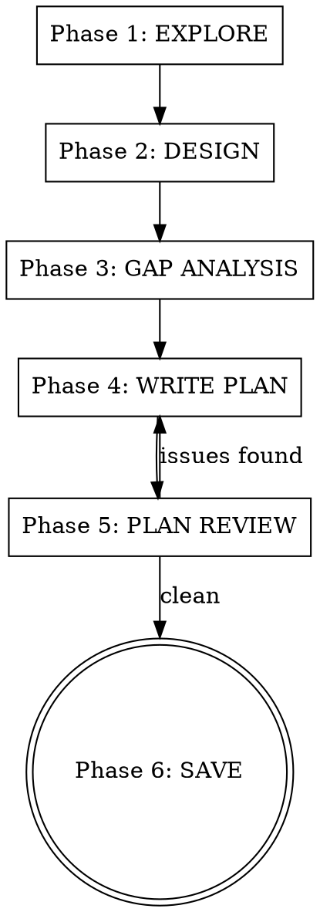

# Design and Plan

Turn an idea into a validated design and detailed implementation plan in one continuous flow. No skill transitions to forget, no context to lose.

**Core principle:** Explore → Design → Stress-test → Plan → Verify → Save. Each phase has a hard gate requiring user approval before proceeding.

<HARD-GATE>
Do NOT write any code, scaffold any project, or take any implementation action during this skill. This skill produces documents, not code.
</HARD-GATE>

## When to Use

- New feature requiring architectural decisions
- Multi-file changes
- Unclear requirements needing exploration
- Any task where "just start coding" would waste time

## When NOT to Use

- Single-line fixes, typos, obvious bugs
- Tasks with very specific, detailed instructions already given
- Pure research or exploration

## Process



**Announce at start:** "Using the design-and-plan skill to design and plan this feature."

**Create a task for each phase** and complete them in order.

## Phase 1: EXPLORE

Gather project context before asking a single question:

- Read relevant source files, docs, recent commits
- Understand existing patterns and architecture
- Identify constraints and dependencies
- Identify the project's tech stack and any framework-specific conventions (React, React Native, Vue, etc.)

**GATE:** Present a brief summary of what you found. Do not proceed until user confirms you have the right context.

## Phase 2: DESIGN

Work through the design collaboratively:

1. Ask clarifying questions **one at a time** (prefer multiple choice)
2. Once you understand the requirements, propose **2-3 approaches** with trade-offs and your recommendation
3. Present the chosen design in sections, get user approval after each section
4. Cover: architecture, components, data flow, error handling

### 2a: Visual Design (for user-facing features)

If the feature involves UI or user-facing changes:

1. Propose the layout structure using component trees, ASCII wireframes, or descriptive mockups
2. Define interaction flows: what the user does → what the system responds
3. Identify states: loading, empty, error, success, partial data
4. Get user approval on the visual structure before proceeding

Skip this substep for backend-only, infrastructure, or non-visual features.

### 2b: Framework Constraints (when a framework is in use)

If the project uses a specific framework (React, React Native, Vue, Svelte, etc.):

1. Identify framework best practices that apply to this design (e.g., component composition patterns, server vs. client boundaries, state management approach)
2. Surface constraints or patterns the design must follow (e.g., "this should be a server component," "use composition instead of prop drilling," "animations must run on native thread")
3. Document these as explicit design constraints that will carry into the plan

These constraints are included in the design doc under a **"Framework Constraints"** section.

**GATE:** User explicitly approves the complete design before proceeding.

## Phase 3: GAP ANALYSIS

Two mandatory review passes over the approved design. Present findings after each pass and get user input.

**Pass 1 — Edge cases and error states:**
- What inputs can be invalid? How are they handled?
- What external dependencies can fail? What's the fallback?
- What happens under concurrent access, partial failure, timeout?
- What data can be missing, malformed, or stale?

**Pass 2 — Integration points and dependencies:**
- What existing behavior could this break?
- What's the data flow between new and existing components?
- Are there race conditions between new and existing code?
- What needs to change in tests, config, or deployment?
- Are any acceptance criteria potentially conflicting with each other?

**GATE:** User reviews and approves all gap analysis findings. Any new requirements are added to the design.

## Phase 4: WRITE PLAN

Break the design into implementation tasks. Each task MUST be self-contained:

```markdown
### Task N: [Name]

**Complexity:** Low / Medium / High
**Risk:** Low / Medium / High

**Context:** [Why this task exists, where it fits in the architecture]

**Files:**
- Create: `exact/path/to/file.ext`
- Modify: `exact/path/to/existing.ext` (which section/function)
- Test: `exact/path/to/test.ext`

**Acceptance criteria:**
- [ ] Specific, verifiable outcome 1
- [ ] Specific, verifiable outcome 2
- [ ] NEGATIVE: [What should NOT happen — e.g., unauthorized users cannot access this]

**Test strategy:**
- Unit tests: [specific behaviors to test in isolation]
- End-user simulation: [describe the user journey this task enables — e.g., "user taps Add Catch, fills form, submits, sees confirmation"]
- Negative tests: [what the tests must reject — invalid inputs, unauthorized access, missing data]

**Steps:**
1. Write failing test for [specific behavior]
2. Run test, verify it fails with [expected error]
3. Implement [specific thing]
4. Run test, verify it passes
5. Write end-user simulation test for [user journey]
6. Run simulation test, verify it passes
7. Commit: "feat: [message]"

**Dependencies:** [Task N-1 must be complete because...]
```

### Rules for self-contained tasks

- Never write "see Task 1" or "as described above" — repeat the context
- Include ALL file paths (not "the file from the previous task")
- Each task must be implementable by someone who has ONLY read that task plus the design doc
- Include exact test commands to run and expected output

### Rules for test planning

- **Every acceptance criterion** must have a corresponding test
- **Negative test cases are mandatory** — for each "it should do X," include "it should NOT do Y" where applicable (unauthorized access, invalid input, boundary violations)
- **End-user simulation tests** must mirror real user behavior — navigate to a screen, interact with elements, verify outcomes from the user's perspective
- **Tests must catch missing implementations** — if the code were deleted, the tests must fail. If a test can pass without the implementation, it's worthless
- **Never use fake data, Math.random(), or placeholder values** in tests — use realistic fixtures or factory functions with deterministic data
- **Framework constraints** from Phase 2b should inform test strategy (e.g., React component tests should verify re-render behavior, not just output)

**GATE:** Do not proceed to review until all tasks are written.

## Phase 5: PLAN REVIEW

Read the entire plan back and check for:

1. **Missing error handling** — Every external call, user input, and file operation has a failure path
2. **Missing tests** — Every acceptance criterion has a corresponding test (both positive and negative)
3. **Unclear acceptance criteria** — Nothing subjective ("should work well"), everything verifiable
4. **Context gaps** — Tasks reference information not included in that task
5. **Ordering issues** — Dependencies are explicit and correct
6. **Conflicting criteria** — No two acceptance criteria (within a task or across tasks) contradict each other
7. **Missing end-user simulation** — User-facing tasks have tests that simulate real user journeys
8. **Missing negative tests** — Security-sensitive or input-handling tasks have "should NOT" test cases
9. **Framework constraint compliance** — If Phase 2b identified constraints, tasks follow them
10. **Risk distribution** — High-risk tasks have proportionally more thorough test coverage

If issues found: fix them and review again. Repeat until clean.

**GATE:** Present the review findings to the user. User confirms the plan is ready.

## Phase 6: SAVE

Save two files:

1. **Design doc:** `docs/plans/YYYY-MM-DD-<topic>-design.md`
2. **Implementation plan:** `docs/plans/YYYY-MM-DD-<topic>-plan.md`

The plan file MUST start with this header:

```markdown
# [Feature Name] Implementation Plan

> **For Claude:** Use the `execute` skill (from deep-planning) to implement this plan.

**Design doc:** `docs/plans/YYYY-MM-DD-<topic>-design.md`

**Goal:** [One sentence]

**Architecture:** [2-3 sentences]

**Tech stack:** [Key technologies]

**Framework constraints:** [Key framework-specific rules from Phase 2b, or "None"]

---
```

Commit both files to git.

**Offer execution choice:**
- **This session:** Invoke `execute` skill now
- **New session:** Open fresh session, load plan file, invoke `execute` skill

## Red Flags

| Thought | Reality |
|---------|---------|
| "The design is obvious, skip to planning" | "Obvious" designs have unexamined assumptions. Phase 2 exists for a reason. |
| "Gap analysis is overkill for this" | Gap analysis catches the bugs you'd spend hours debugging later. |
| "This task is clear enough without full context" | Self-contained tasks prevent the #1 execution failure: information loss. |
| "I'll review the plan later" | Phase 5 catches issues that compound across tasks. Review now. |
| "Let me start coding to explore" | Explore with reads and searches, not implementation. |
| "One more question before we move on" | Stay in the current phase. Don't sneak Phase 2 questions into Phase 3. |
| "Negative tests are overkill" | Negative tests catch security holes and permission bugs. Always include them. |
| "The user can test it manually" | End-user simulation tests automate what the user would check. Don't skip them. |
| "Tests will slow down the plan" | Tests that catch missing implementations save hours of debugging. Plan them now. |
