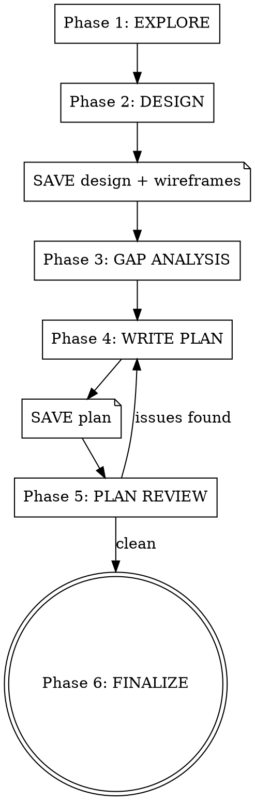
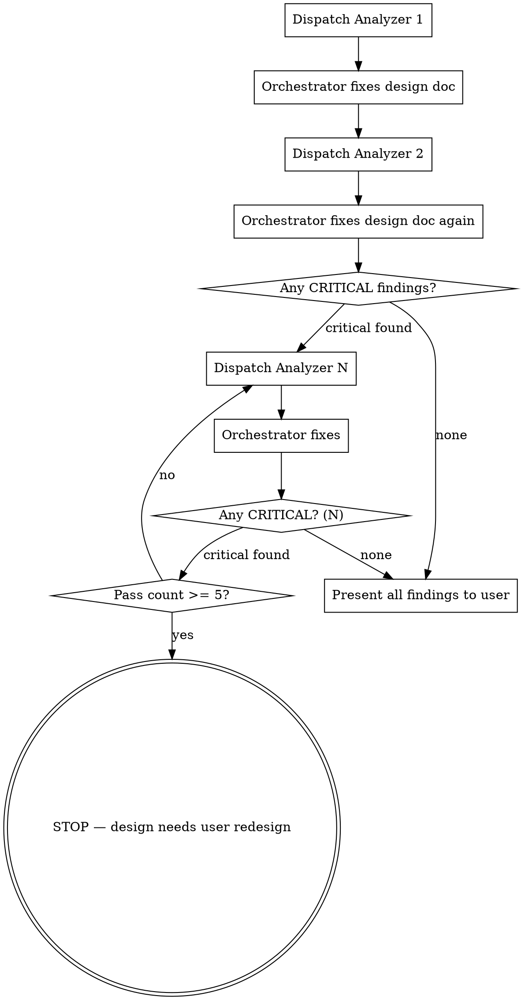

# Design and Plan

Turn an idea into a validated design and detailed implementation plan in one continuous flow. No skill transitions to forget, no context to lose.

**Core principle:** Explore → Design → Stress-test → Plan → Verify → Save. Each phase has a hard gate requiring user approval before proceeding.

<HARD-GATE>
Do NOT write any code, scaffold any project, or take any implementation action during this skill. This skill produces documents, not code.
</HARD-GATE>

## Context Window Management

This skill runs in a single session across many phases. To prevent context exhaustion:

- **Save artifacts to files as soon as each phase completes** — don't hold everything in memory until the end
- **After saving a file, refer to it by path** — don't repeat its contents in conversation
- The save points are marked with `SAVE TO DISK` below

## When to Use

- New feature requiring architectural decisions
- Multi-file changes
- Unclear requirements needing exploration
- Any task where "just start coding" would waste time

## When NOT to Use

- Single-line fixes, typos, obvious bugs
- Tasks with very specific, detailed instructions already given
- Pure research or exploration

## Process



**Announce at start:** "Using the design-and-plan skill to design and plan this feature."

**Create a task for each phase** and complete them in order.

## Making Recommendations

Throughout all phases, **proactively recommend best practices** based on coding, architecture, and design knowledge. Do not wait for the user to ask. If a design decision would benefit from a specific pattern, a more scalable approach, or a known best practice — say so and explain why. The user is relying on expert guidance, not just transcription of their ideas.

Examples:
- "I'd recommend using a context provider here instead of prop drilling, because..."
- "This data flow would benefit from optimistic updates to keep the UI responsive..."
- "Based on the existing codebase patterns, this should follow the same service layer structure as..."

## Phase 1: EXPLORE

Gather project context before asking a single question:

- Read relevant source files, docs, recent commits
- Understand existing patterns and architecture
- Identify constraints and dependencies
- Identify the project's tech stack and any framework-specific conventions (React, React Native, Vue, etc.)
- **Study existing UI patterns** — note current styling, component conventions, icon usage, color schemes, and whether emojis are used in the UI. New designs must match existing visual language.

**GATE:** Present a brief summary of what you found. Do not proceed until user confirms you have the right context.

## Phase 2: DESIGN

Work through the design collaboratively:

1. Ask clarifying questions **one at a time** (prefer multiple choice)
2. Once you understand the requirements, propose **2-3 approaches** with trade-offs and your recommendation
3. Present the chosen design in sections, get user approval after each section
4. Cover: architecture, components, data flow, error handling
5. **Number design elements** for traceability — each architectural component, data flow, error strategy, and UI screen gets an ID (e.g., D1, D2, D3). Tasks in Phase 4 reference these IDs to ensure full coverage.

### 2a: Visual Design (for user-facing features)

If the feature involves UI or user-facing changes:

1. **Invoke the `ui-ux-pro-max` skill** to guide visual design decisions (layout, typography, color, spacing, interaction patterns)
2. **Match the existing app's visual language** — study current screens, components, and styling before proposing anything new. If the app doesn't use emojis, don't introduce them. If it uses a specific icon library, use that. Match existing spacing, fonts, and color patterns.
3. Propose the layout structure using component trees, ASCII wireframes, or descriptive mockups
4. Define interaction flows: what the user does → what the system responds
5. Identify states: loading, empty, error, success, partial data
6. Get user approval on the visual structure before proceeding

Skip this substep for backend-only, infrastructure, or non-visual features.

### 2b: Framework Constraints (when a framework is in use)

If the project uses a specific framework (React, React Native, Vue, Svelte, etc.):

1. Identify framework best practices that apply to this design (e.g., component composition patterns, server vs. client boundaries, state management approach)
2. Surface constraints or patterns the design must follow (e.g., "this should be a server component," "use composition instead of prop drilling," "animations must run on native thread")
3. Document these as explicit design constraints that will carry into the plan

These constraints are included in the design doc under a **"Framework Constraints"** section.

### 2c: Wireframes and Diagrams

Create visual documentation to align understanding between AI and user. Pick the **2-3 most relevant diagram types** for this specific feature — not every feature needs every diagram type.

**Diagram types (choose what's relevant):**

| Diagram | When to use |
|---------|------------|
| **Wireframes** | Any new/modified screen or UI component — show layout, hierarchy, all states |
| **User flow** | Features with multi-step user journeys or decision points |
| **Data flow** | Features involving data moving between frontend, backend, APIs, storage |
| **Integration diagram** | Features connecting to external services, APIs, or databases |
| **Architecture diagram** | Features adding new system components or changing structure |
| **State transition** | Features with complex state machines (order status, multi-step flows) |
| **Sequence diagram** | Complex multi-party interactions (user → frontend → backend → external) |
| **Navigation flow** | Changes to app navigation, tab structure, or routing |

**Rules:**
- Use ASCII art, Mermaid syntax, or structured markdown tables
- Keep diagrams readable — the goal is alignment with a non-technical user
- Present each diagram and get approval before proceeding
- For UI features: wireframes + user flow are almost always needed
- For backend features: data flow + integration diagram are most useful

**GATE:** User explicitly approves the complete design (including diagrams) before proceeding.

### `SAVE TO DISK` — Save design doc and wireframes

**Immediately after the user approves the design, save two files:**

1. **Design doc:** Write to `docs/plans/YYYY-MM-DD-<topic>-design.md`
   - Architecture decisions, component design, data flow, error handling, framework constraints
2. **Wireframes:** Write to `docs/plans/YYYY-MM-DD-<topic>-wireframes.md`
   - All diagrams from Phase 2c, organized by type, labeled with related tasks/features

**Why now:** These files can be large. Saving them frees context for Phases 3-5. From this point forward, refer to them by file path — don't repeat their contents.

For backend-only features with no diagrams, skip the wireframes file.

## Phase 3: GAP & EDGE CASE ANALYSIS

Iterative stress-testing through independent subagent analysis. Each pass uses a fresh subagent that explores both the design doc AND the actual codebase — no knowledge of previous findings, eliminating anchoring bias. The design doc is progressively hardened until it stabilizes.

### Flow



### Process

**Pass 1 (mandatory):**
1. Dispatch gap-analysis subagent (`./gap-analyzer-prompt.md`) with design doc and wireframes paths
2. Review findings. Fix ALL critical and important findings by updating the design doc
3. Save updated design doc to disk. Commit.

**Pass 2 (mandatory):**
1. Dispatch a NEW gap-analysis subagent with the UPDATED design doc path. Fresh context — no awareness of Pass 1.
2. Review findings. Fix ALL critical and important findings.
3. Save updated design doc. Commit.
4. **Convergence check:** Did this pass return any CRITICAL findings?

**Pass 3+ (conditional — only if critical findings persist):**
1. Dispatch another NEW subagent with the latest design doc
2. Fix findings, save, commit
3. Check: any CRITICAL findings?
   - No → design has stabilized, proceed
   - Yes → loop again

**Ceiling:** Maximum 5 total passes. If critical findings persist after 5 passes, STOP and escalate to the user. The design has a fundamental issue that needs human redesign, not more iteration.

### Between passes: what the orchestrator does

The orchestrator's job between passes is lightweight and specific:
1. **Read** the subagent's findings
2. **Update the design doc** to address critical/important findings — add error handling requirements, specify fallback behaviors, add missing states, clarify ambiguous decisions
3. **Save** the updated design doc to disk and commit
4. **Track** a running count of passes and a cumulative finding log (compact — just finding titles and severities)
5. **Dispatch** the next subagent

The orchestrator does NOT re-analyze. It applies fixes and moves on. All analytical work happens in subagent context.

### Present to user

After convergence, present a deduplicated summary across all passes:
- How many passes were needed to reach convergence
- Key critical findings that were fixed (and how)
- Remaining IMPORTANT/MINOR findings for user awareness
- Any patterns across passes (e.g., "security gaps kept appearing — consider a dedicated security review")

**After gap analysis:** Update the saved design doc with a "Gap Analysis Summary" section listing key findings and resolutions. Commit the update.

**GATE:** User reviews and approves gap analysis findings.

## Phase 4: WRITE PLAN

Break the design into implementation tasks. Each task MUST be self-contained:

```markdown
### Task N: [Name]

**Complexity:** Low / Medium / High
**Risk:** Low / Medium / High

**Context:** [Why this task exists, where it fits in the architecture]

**Files:**
- Create: `exact/path/to/file.ext`
- Modify: `exact/path/to/existing.ext` (which section/function)
- Test: `exact/path/to/test.ext`

**Acceptance criteria:**
- [ ] Specific, verifiable outcome 1
- [ ] Specific, verifiable outcome 2
- [ ] NEGATIVE: [What should NOT happen — e.g., unauthorized users cannot access this]

**Test strategy:**
- Unit tests: [specific behaviors to test in isolation]
- End-user simulation: [describe the user journey this task enables — e.g., "user taps Add Catch, fills form, submits, sees confirmation"]
- Negative tests: [what the tests must reject — invalid inputs, unauthorized access, missing data]

**Steps:**
1. Write failing test for [specific behavior]
2. Run test, verify it fails with [expected error]
3. Implement [specific thing]
4. Run test, verify it passes
5. Write end-user simulation test for [user journey]
6. Run simulation test, verify it passes
7. Commit: "feat: [message]"

**Dependencies:** [Task N-1 must be complete because...]
```

### Design coverage matrix

After writing all tasks, create a traceability table mapping every design element to tasks:

```markdown
| Design ID | Design Element | Design Doc Section | Task(s) | Status |
|---|---|---|---|---|
| D1 | Auth middleware | Architecture > Backend | Task 2, Task 5 | Covered |
| D2 | Error retry logic | Error Handling | Task 4 | Covered |
| D3 | Profile component | Architecture > Frontend | ??? | **UNCOVERED** |
```

Every numbered design element (components, flows, error strategies, framework constraints) must map to at least one task. Every gap analysis finding must map to at least one acceptance criterion. **If any element is UNCOVERED, add a task or justify its exclusion to the user.**

Include this matrix in the plan file after the task list.

### Rules for self-contained tasks

- Never write "see Task 1" or "as described above" — repeat the context
- Include ALL file paths (not "the file from the previous task")
- Each task must be implementable by someone who has ONLY read that task plus the design doc
- Include exact test commands to run and expected output

### Rules for test planning

- **Every acceptance criterion** must have a corresponding test
- **Negative test cases are mandatory** — for each "it should do X," include "it should NOT do Y" where applicable (unauthorized access, invalid input, boundary violations)
- **End-user simulation tests** must mirror real user behavior — navigate to a screen, interact with elements, verify outcomes from the user's perspective
- **Tests must catch missing implementations** — if the code were deleted, the tests must fail. If a test can pass without the implementation, it's worthless
- **Never use fake data, Math.random(), or placeholder values** in tests — use realistic fixtures or factory functions with deterministic data
- **Framework constraints** from Phase 2b should inform test strategy (e.g., React component tests should verify re-render behavior, not just output)

### `SAVE TO DISK` — Save plan file

**Immediately after writing all tasks, save the plan file:**

Write to `docs/plans/YYYY-MM-DD-<topic>-plan.md` with this header:

```markdown
# [Feature Name] Implementation Plan

> **For Claude:** Use the `execute` skill (from deep-planning) to implement this plan.

**Design doc:** `docs/plans/YYYY-MM-DD-<topic>-design.md`

**Wireframes:** `docs/plans/YYYY-MM-DD-<topic>-wireframes.md`

**Goal:** [One sentence]

**Architecture:** [2-3 sentences]

**Tech stack:** [Key technologies]

**Framework constraints:** [Key framework-specific rules from Phase 2b, or "None"]

---
```

**Why now:** The plan file can be large (especially with many tasks). Save it before review so context is freed. Phase 5 reads it back from disk.

**GATE:** Do not proceed to review until the plan file is saved.

## Phase 5: PLAN REVIEW

<IMPORTANT>
The plan review presented to the user must be **brief, code-free, and easy to read.** The user may not be a developer. Do NOT include code snippets, file contents, or technical implementation details in the review summary. Focus on WHAT is changing and WHY.
</IMPORTANT>

### Parallel validation subagents

Dispatch three validation subagents **in parallel** — they are independent and read only the saved plan file and design doc:

| Subagent | Template | What It Checks |
|----------|----------|----------------|
| **Coverage verifier** | `./coverage-verifier-prompt.md` | Every design element maps to a task, every gap finding maps to a criterion, framework constraints are enforced |
| **Plan quality checker** | `./plan-quality-checker-prompt.md` | Criteria clarity, self-containment, dependency ordering, conflicts, error handling, risk distribution, step quality |
| **Test strategy auditor** | `./test-strategy-auditor-prompt.md` | Criterion-to-test mapping, negative tests, simulation tests, test isolation, edge cases, data quality |

All three run simultaneously. Wait for all three to complete before proceeding.

### Merge findings and fix

1. Collect reports from all three subagents
2. Deduplicate any overlapping findings
3. Fix ALL critical and important issues by updating the plan file
4. If fixes add new tasks, criteria, or tests — re-save the plan file
5. If fixes are extensive (new tasks added, criteria rewritten), consider re-running the affected validator to confirm the fix

### Transparency on fixes

If any changes were made to the plan during validation:
1. Track all modifications
2. Present a "Changes made during review" section BEFORE the task summary:
   - "Added missing error handling criterion to Task 3"
   - "Clarified ambiguous acceptance criterion in Task 7"
   - "Added negative test requirement to Task 5"
   - "Added Task 9 to cover uncovered design element D3"
   - "Fixed dependency ordering between Task 4 and Task 6"
3. User must acknowledge these changes as part of the approval gate

### Present to user (brief, no code)

Present the plan review as a concise summary for each task:

```markdown
**Task N: [Name]** (Complexity: X | Risk: X)
- **What:** [One sentence — what this task builds or changes]
- **Why:** [One sentence — why it's needed]
- **Key details:** [Any important notes — dependencies, risk factors, things the user should know]
```

Follow with a brief overall summary:
- Total tasks and estimated complexity distribution
- Any recommendations or trade-offs the user should be aware of
- Diagram references ("see wireframes doc for screen layouts")

**GATE:** User confirms the plan is ready.

## Phase 6: FINALIZE

All three files should already be saved from earlier phases:

1. `docs/plans/YYYY-MM-DD-<topic>-design.md` (saved after Phase 2)
2. `docs/plans/YYYY-MM-DD-<topic>-wireframes.md` (saved after Phase 2, if applicable)
3. `docs/plans/YYYY-MM-DD-<topic>-plan.md` (saved after Phase 4)

Final steps:
1. Verify all three files are saved and consistent
2. Commit all files to git (if not already committed individually)
3. Present file paths to user

**Offer execution choice:**
- **This session:** Invoke `execute` skill now
- **New session:** Open fresh session, load plan file, invoke `execute` skill

## Red Flags

| Thought | Reality |
|---------|---------|
| "The design is obvious, skip to planning" | "Obvious" designs have unexamined assumptions. Phase 2 exists for a reason. |
| "Gap analysis is overkill for this" | Gap analysis catches the bugs you'd spend hours debugging later. |
| "This task is clear enough without full context" | Self-contained tasks prevent the #1 execution failure: information loss. |
| "I'll review the plan later" | Phase 5 catches issues that compound across tasks. Review now. |
| "Let me start coding to explore" | Explore with reads and searches, not implementation. |
| "One more question before we move on" | Stay in the current phase. Don't sneak Phase 2 questions into Phase 3. |
| "Negative tests are overkill" | Negative tests catch security holes and permission bugs. Always include them. |
| "The user can test it manually" | End-user simulation tests automate what the user would check. Don't skip them. |
| "Tests will slow down the plan" | Tests that catch missing implementations save hours of debugging. Plan them now. |
| "I'll skip the wireframes for this one" | Wireframes catch layout misunderstandings before any code is written. Always include them for UI work. |
| "I know what looks good here" | Study the existing app first. Match its visual language — don't introduce new patterns, emojis, or styles that don't exist in the current UI. |
| "The user will figure out the technical details" | Present the plan review without code. The user needs to understand WHAT and WHY, not HOW. |
| "This is fine as-is, no recommendation needed" | If a better approach exists, say so. The user relies on expert guidance. |
| "I'll save everything at the end" | Save artifacts as each phase completes. Holding everything in memory risks context exhaustion. |
| "Two gap analysis passes is enough" | If critical findings exist after pass 2, the design hasn't stabilized. Keep iterating until convergence. |
| "I don't need to check design coverage" | Uncovered design elements are the #1 source of missing tasks. Always verify the coverage matrix. |
| "The gap findings are already covered by the tasks" | Verify explicitly — don't assume. Check each gap finding against actual acceptance criteria. |
| "The subagent doesn't need to read the codebase" | A gap analyzer that only reads the design doc is guessing. Codebase exploration finds the highest-value gaps. |
