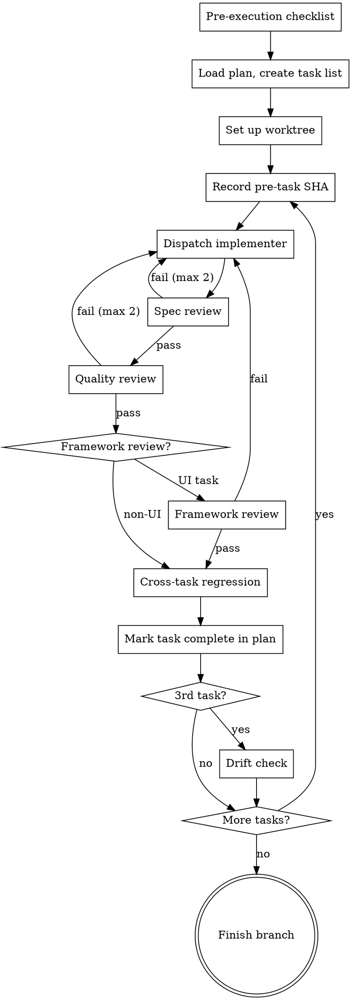

# Execute Plan

Execute an implementation plan by dispatching isolated subagents per task. Subagents read the plan file directly — no information loss through orchestrator paraphrasing.

**Core principle:** Subagent reads plan → implements → spec review → quality review → regression check → next task. Drift check every 3 tasks.

## When to Use

- You have a saved implementation plan (from `design-and-plan` or similar)
- Plan has discrete, ordered tasks with acceptance criteria
- Tasks are mostly independent

## Process



**Announce at start:** "Using the execute skill to implement this plan."

## Pre-Execution Checklist

Before starting any task, verify:

- [ ] Plan file exists and is readable at the specified path
- [ ] Design doc exists and is readable (path from plan header)
- [ ] Git working directory is clean (no uncommitted changes)
- [ ] Test runner works (`npm test`, `pytest`, etc. — run and confirm it executes)
- [ ] Worktree or feature branch is set up (not on main/master)
- [ ] Plan file has the required header (Goal, Architecture, Tech stack, Design doc path)
- [ ] Baseline test results captured: run full test suite, record pass/fail/skip counts (e.g., "Baseline: 142 pass, 0 fail, 3 skip"). After each task, no NEW failures allowed — compare against this baseline.
- [ ] If plan is more than 48 hours old, verify key assumptions in the design doc still hold (API formats, package versions, service availability)

If any check fails, fix it before proceeding. Do not start execution with a broken environment.

## Step 1: Load Plan

1. Read the plan file
2. Review critically — raise any concerns before starting
3. Create a task list tracking all plan tasks
4. Note the design doc path from the plan header
5. Note the framework constraints (if any) from the plan header

## Step 2: Set Up Workspace

Create an isolated workspace for the implementation. If `superpowers:using-git-worktrees` is available, use it. Otherwise, create a feature branch.

Never start implementation on main/master without explicit user consent.

## Step 3: Execute Tasks

For each task:

### 3.0: Pre-Task Checks

**Dependency validation:** Before starting each task, verify that all tasks listed in its "Dependencies" field have COMPLETE markers in the plan file. If a dependency was rolled back, STOP and escalate — the dependent task cannot proceed on a broken foundation.

**Record checkpoint:** Before dispatching the implementer, record the current git SHA:

```bash
TASK_N_PRE_SHA=$(git rev-parse HEAD)
```

This SHA enables safe rollback if the task goes catastrophically wrong (see Rollback section).

### 3a: Implementer

Dispatch a `general-purpose` Task agent using `./implementer-prompt.md` template.

**CRITICAL:** Tell the subagent to **read the plan file itself** at the exact path. Do NOT paste task text into the prompt. The orchestrator provides:
- Plan file path
- Task number and name
- Design doc path
- Working directory

The subagent reads everything else directly. This eliminates information loss.

### Subagent Turn Limits

When dispatching subagents via the Task tool, set `max_turns` to prevent hangs:

| Subagent | max_turns |
|----------|-----------|
| Implementer | 30 |
| Spec reviewer | 15 |
| Quality reviewer | 15 |
| Framework reviewer | 15 |
| Drift check | 10 |

If a subagent hits its turn limit without completing, treat as a failure and follow the retry policy.

### 3b: Spec Review

Dispatch a `general-purpose` Task agent using `./spec-reviewer-prompt.md` template.

The spec reviewer reads the plan file, finds the task's acceptance criteria, and verifies the actual code against them. Nothing more, nothing less.

**If issues found:** Dispatch a new implementer subagent to fix the specific issues, then re-run spec review.

### 3c: Quality Review

**Only after spec review passes.** Dispatch a `general-purpose` Task agent using `./quality-reviewer-prompt.md` template.

Reviews code quality, error handling, test quality, adherence to existing patterns, and verifies that only files in the task's scope were modified.

**If critical or important issues found:** Dispatch a new implementer to fix, then re-run quality review.

### 3d: Framework Review (for UI tasks)

**Only after quality review passes. Only for tasks that create or modify UI components.**

If the plan header specifies framework constraints, or the task modifies UI components (React, React Native, Vue, etc.):

1. Dispatch a `general-purpose` Task agent using `./framework-reviewer-prompt.md` template
2. The reviewer checks framework-specific patterns, performance, composition, and accessibility
3. Issues rated as Critical/Important/Minor (same as quality reviewer)
4. Critical/Important issues loop back to implementer

Skip this step for backend-only, infrastructure, or non-UI tasks.

### 3e: Cross-Task Regression Test

After all reviews pass for the current task, **run the full test suite** (not just the current task's tests):

```bash
# Run ALL tests, not just the current task's tests
npm test  # or appropriate test command for the project
```

**If regressions found:** The current task broke something from a previous task. Stop and fix before proceeding. This is NOT optional — skipping regression testing allows integration failures to compound.

### 3f: Mark Task Complete

After all reviews pass AND regression tests pass:

1. Update the plan file: change the task's acceptance criteria checkboxes from `- [ ]` to `- [x]`
2. Add a completion annotation below the task:
   ```markdown
   **Status:** COMPLETE | SHA: {commit_sha} | Reviewed: spec, quality[, framework]
   ```
3. Commit the plan file update: `"chore: mark Task N complete in plan"`

This enables resumability — if the session is interrupted, a new session can scan the plan file for completion markers and resume from the first incomplete task.

## Retry Policy

Review loops are not infinite. Follow this escalation:

| Situation | Action |
|-----------|--------|
| Spec review fails once | Normal: dispatch implementer to fix specific issues, re-run spec review |
| Spec review fails twice on same task | The task spec is probably ambiguous. Re-read the task and design doc. Rewrite the task's acceptance criteria to be clearer. Then retry. |
| Spec review fails 3 times | **STOP.** Ask the user — the task may need redesign. |
| Quality review fails once | Normal: dispatch implementer to fix, re-run quality review |
| Quality review fails twice | **STOP.** Ask the user — the implementation approach may be wrong. |
| Framework review fails once | Normal: dispatch implementer to fix, re-run framework review |
| Framework review fails twice | **STOP.** Ask the user — the component architecture may need rethinking. |
| Any combination totaling 4+ review cycles on one task | **STOP.** Something fundamental is wrong. Discuss with user. |

## Rollback

If a task needs to be completely abandoned (not just fixed), use a safe rollback:

```bash
# Safe rollback — creates undo commits, preserves history
git revert --no-commit ${TASK_N_PRE_SHA}..HEAD
git commit -m "revert: abandon Task N implementation for retry"
```

**NEVER use `git reset --hard`** — it destroys history and may be blocked by security tooling. `git revert` is always safe and auditable.

## Step 4: Drift Check (Every 3 Tasks)

After every 3rd completed task, dispatch a subagent using `./drift-check-prompt.md` template.

Compares the current implementation against the original design doc. If drift is found: **STOP and discuss with user before continuing.**

### Design Doc Updates

When a drift check finds divergence and the user approves it as intentional:

1. Update the design doc to reflect the new reality
2. Note what changed and why in a `## Design Revisions` section at the bottom
3. Commit the design doc update: `"docs: update design doc — [what changed]"`
4. Continue execution with the updated design as the new baseline

Do NOT allow the design doc and implementation to remain out of sync — this makes future drift checks unreliable.

### Cumulative Drift Awareness

If the design doc has a "Design Revisions" section with prior approved changes, the drift check subagent will compare against both the current design AND the original design (before revisions). This tracks cumulative drift — each individual change may be approved, but the aggregate might be a significant departure from the original vision. If cumulative drift is significant, the user should understand how far the implementation has moved.

## Step 5: Finish

After completing what you believe is the last task, run the post-execution verification before finishing.

### Post-Execution Verification (mandatory)

1. **Re-read the entire plan file from disk** — do not rely on memory
2. **Count verification:**
   - Count total tasks defined in the plan (by counting `### Task N:` headers)
   - Count tasks with `**Status:** COMPLETE` markers
   - Assert counts are equal
   - If mismatch: list specific task numbers missing COMPLETE markers and execute them before proceeding
3. **Do NOT proceed to PR creation until counts match**

### Finish Steps

1. Run full test suite (final comprehensive pass)
2. Verify post-execution verification passed (counts match)
3. If `superpowers:verification-before-completion` is available, use it
4. If `superpowers:finishing-a-development-branch` is available, use it
5. Otherwise: create PR, present summary to user

### Archive Plan Files

After the PR is created (or merged) and all validation is complete:

1. Create the archive directory if it doesn't exist:
   ```bash
   mkdir -p docs/plans/completed
   ```
2. Move all plan files to the archive (plan, design doc, and wireframes):
   ```bash
   git mv docs/plans/YYYY-MM-DD-<topic>-plan.md docs/plans/completed/
   git mv docs/plans/YYYY-MM-DD-<topic>-design.md docs/plans/completed/
   git mv docs/plans/YYYY-MM-DD-<topic>-wireframes.md docs/plans/completed/
   ```
   Note: The wireframes file may not exist for backend-only features. Only move files that exist.
3. Commit the archive move:
   ```bash
   git commit -m "chore: archive completed plan — [topic]"
   ```

This keeps `docs/plans/` clean for active work while preserving completed plans for reference. Do NOT archive until the PR is created and all validation has passed — the plan file must remain in place during execution for resumability.

## Resuming an Interrupted Execution

If a session is interrupted (crash, context limit, user absence):

1. Read the plan file
2. Scan for completion markers (`**Status:** COMPLETE`)
3. Find the first task WITHOUT a completion marker — this is where to resume
4. Verify the git state matches the last completed task's SHA
5. **Check for partial work on the incomplete task:**
   - Search git log for commits mentioning the incomplete task number
   - If commits exist but no COMPLETE marker: the task was partially completed — route to **spec review first** (not implementer). If spec review passes, continue with quality review → framework review → regression. If spec review fails, dispatch implementer to fix specific issues only.
   - If no commits exist for the incomplete task: start fresh with implementer
6. Continue execution from the incomplete task

## Red Flags

| Signal | Action |
|--------|--------|
| Subagent asks questions | Answer clearly before letting them proceed |
| Spec review fails twice on same task | Re-examine the task spec — it may be ambiguous |
| Drift check finds divergence | Stop execution, discuss with user |
| Test failures in unrelated code | Stop, investigate before continuing |
| Tempted to paste task text into prompt | Don't. Let the subagent read the file. |
| Tempted to skip spec review | Never. This catches the most common failure mode. |
| Regression tests fail after task completes | Current task broke previous work. Fix before next task. |
| Review loops exceed retry policy | Stop. Escalate to user. Something fundamental is wrong. |
| Plan file has no completion markers | Either this is a fresh start or markers were lost. Verify with git log. |
| Task count doesn't match COMPLETE count at finish | Tasks were skipped. Re-read the plan file and execute missing tasks before creating PR. |
| Commits exist for a task but no COMPLETE marker | Partial completion from interrupted session. Route to spec review, not fresh implementation. |
| Subagent hits turn limit | Treat as failure. Follow retry policy. Do not dispatch the same subagent again without changes. |

## Never

- Paste task text into subagent prompts (let them read the file)
- Skip spec review or quality review
- Continue after drift check finds issues
- Run multiple implementer subagents in parallel (file conflicts)
- Start on main/master without user consent
- Accept "close enough" on spec compliance
- Move to next task while reviews have open issues
- Skip regression testing between tasks
- Exceed retry policy without user consultation
- Use `git reset --hard` for rollback (use `git revert` instead)
- Leave the plan file without completion markers after a task passes
- Finish without verifying task count matches COMPLETE marker count
- Skip dependency validation when resuming after a rollback
- Dispatch subagents without setting max_turns
