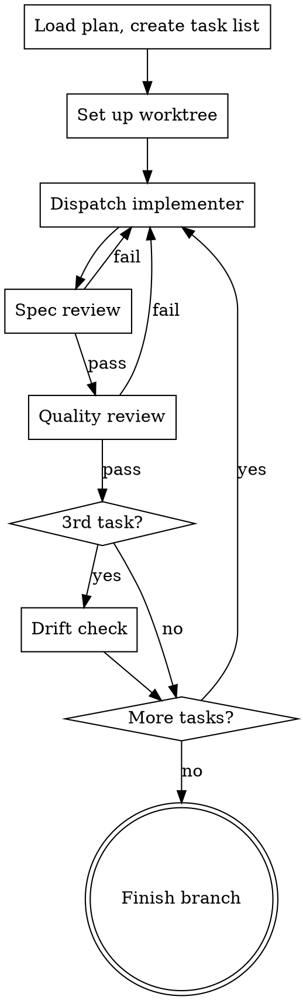

# Execute Plan

Execute an implementation plan by dispatching isolated subagents per task. Subagents read the plan file directly — no information loss through orchestrator paraphrasing.

**Core principle:** Subagent reads plan → implements → spec review → quality review → next task. Drift check every 3 tasks.

## When to Use

- You have a saved implementation plan (from `design-and-plan` or similar)
- Plan has discrete, ordered tasks with acceptance criteria
- Tasks are mostly independent

## Process

**Announce at start:** "Using the execute skill to implement this plan."

## Step 1: Load Plan

1. Read the plan file
2. Review critically — raise any concerns before starting
3. Create a task list tracking all plan tasks
4. Note the design doc path from the plan header

## Step 2: Set Up Workspace

Create an isolated workspace for the implementation. If `superpowers:using-git-worktrees` is available, use it. Otherwise, create a feature branch.

Never start implementation on main/master without explicit user consent.

## Step 3: Execute Tasks

For each task, dispatch three subagents in sequence:

### 3a: Implementer

Dispatch a `general-purpose` Task agent using `./implementer-prompt.md` template.

**CRITICAL:** Tell the subagent to **read the plan file itself** at the exact path. Do NOT paste task text into the prompt. The orchestrator provides:
- Plan file path
- Task number and name
- Design doc path
- Working directory

The subagent reads everything else directly. This eliminates information loss.

### 3b: Spec Review

Dispatch a `general-purpose` Task agent using `./spec-reviewer-prompt.md` template.

The spec reviewer reads the plan file, finds the task's acceptance criteria, and verifies the actual code against them. Nothing more, nothing less.

**If issues found:** Dispatch a new implementer subagent to fix the specific issues, then re-run spec review.

### 3c: Quality Review

**Only after spec review passes.** Dispatch a `general-purpose` Task agent using `./quality-reviewer-prompt.md` template.

Reviews code quality, error handling, test quality, and adherence to existing patterns.

**If critical or important issues found:** Dispatch a new implementer to fix, then re-run quality review.

## Step 4: Drift Check (Every 3 Tasks)

After every 3rd completed task, dispatch a subagent using `./drift-check-prompt.md` template.

Compares the current implementation against the original design doc. If drift is found: **STOP and discuss with user before continuing.**

## Step 5: Finish

After all tasks complete:

1. Run full test suite
2. If `superpowers:verification-before-completion` is available, use it
3. If `superpowers:finishing-a-development-branch` is available, use it
4. Otherwise: create PR, present summary to user

## Red Flags

| Signal | Action |
|--------|--------|
| Subagent asks questions | Answer clearly before letting them proceed |
| Spec review fails twice on same task | Re-examine the task spec — it may be ambiguous |
| Drift check finds divergence | Stop execution, discuss with user |
| Test failures in unrelated code | Stop, investigate before continuing |
| Tempted to paste task text into prompt | Don't. Let the subagent read the file. |
| Tempted to skip spec review | Never. This catches the most common failure mode. |

## Never

- Paste task text into subagent prompts (let them read the file)
- Skip spec review or quality review
- Continue after drift check finds issues
- Run multiple implementer subagents in parallel (file conflicts)
- Start on main/master without user consent
- Accept "close enough" on spec compliance
- Move to next task while reviews have open issues
